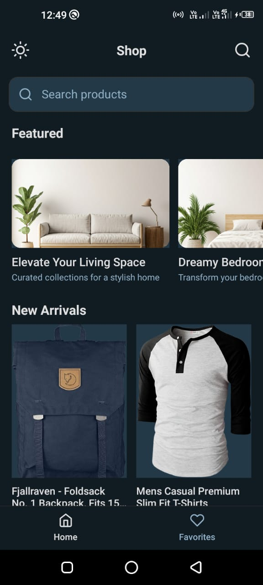
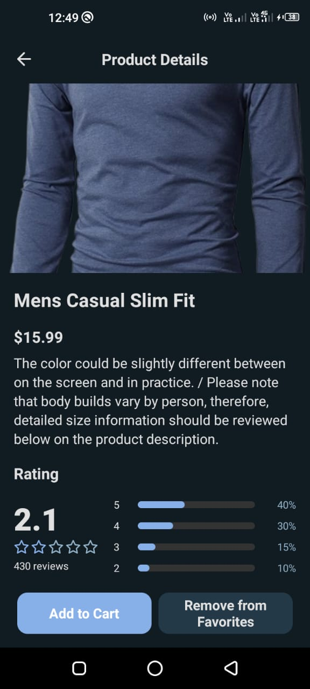
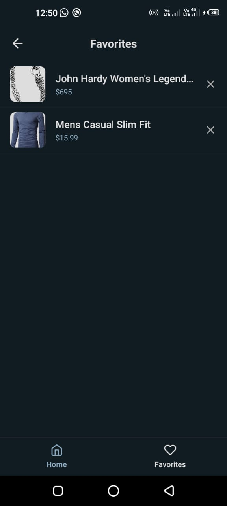

# myprolist (React Native)

Small product-listing app demonstrating paging, product details and favorites with basic offline support using TanStack Query + AsyncStorage.

## Goals
- Fast UX by caching network responses.
- Read-only offline support: previously fetched pages and product details available after restart.
- Persist user favorites across restarts.

---

## Screenshots

| Home Screen | Product Detail Screen | Favorites Screen |
|:------------:|:--------:|:------------:|
|  |  |  |


---

## Quick setup

1. Install JS deps
```sh
npm install
# or
yarn
```

2. Install offline/native deps
```sh
npm install @tanstack/react-query @tanstack/react-query-persist-client @tanstack/query-async-storage-persister @react-native-async-storage/async-storage @react-native-community/netinfo axios
```

3. iOS only (macOS)
```sh
cd ios
bundle install        # optional if using bundler
bundle exec pod install
cd ..
```

4. Run
```sh
npm start
npm run android
npm run ios
```

## Key libraries and why

- @tanstack/react-query
  - Caching, background refetch, retries and mutation helpers. Good fit for read-heavy UIs.
- @tanstack/react-query-persist-client + @tanstack/query-async-storage-persister
  - Persist react-query cache to AsyncStorage so cached queries survive app restarts.
- @react-native-async-storage/async-storage
  - Cross-platform persistent key/value storage used for query cache and favorites.
- @react-native-community/netinfo
  - Mobile network state detection — wired into react-query onlineManager so refetches happen only when online.
- axios / fetch
  - HTTP client(s) used by the API module.
- react-native-safe-area-context
  - Safe-area handling for UI.

## How offline support is implemented (design / reasoning)

1. Persisted query cache
   - The QueryClient cache is persisted to AsyncStorage. This provides lightweight, app-wide read-only offline support without introducing a DB.
   - Reason: simplest way to show previously fetched pages and items immediately on cold start.

2. NetInfo → onlineManager wiring
   - NetInfo updates react-query's onlineManager so refetch behavior is correct (no spurious network calls when offline; automatic refetch when back online).
   - Reason: reliable connectivity detection avoids failed network attempts.

3. AppState focus handling
   - AppState changes are used to trigger refetch-on-focus behavior when the app becomes active.
   - Reason: keep data fresh when returning to foreground without aggressive polling.

4. Single-item cache warming
   - The list screen warms per-item cache entries (['product', id]) in onSuccess of useInfiniteQuery.
   - ProductDetailsScreen uses getCachedProductById(queryClient, id) as initialData for useQuery, falling back to route.params and only hitting network when needed.
   - Reason: deterministic, fast hydration of details screen from persisted cache and avoids scanning unrelated queries.

5. Favorites persistence
   - FavoritesContext persists favorites to AsyncStorage so favorites survive restarts and are available offline.
   - Reason: user-facing data that must survive restarts — small and simple to persist.


## Important files
- App.jsx — QueryClient config, persister, NetInfo + AppState wiring.
- src/lib/cacheUtils.js — getCachedProductById helper used by details screen.
- src/screens/HomeScreen.jsx — useInfiniteQuery; warms per-item cache in onSuccess.
- src/screens/ProductDetailsScreen.jsx — uses useQuery with initialData from cacheUtils.
- src/context/FavoritesContext.jsx — AsyncStorage-backed favorites.

## Limitations and trade-offs

- Read-only offline only: cached reads are supported. Offline writes (create/update/delete while offline) are not reconciled with server automatically.
- Not a full sync engine: for complex offline-first requirements use SQLite/Realm/WatermelonDB + a sync/queue system.
- Large datasets: scanning or caching many items in memory may not scale. Consider normalizing entities or using a local DB.


"# myprolist-react-native-app" 
